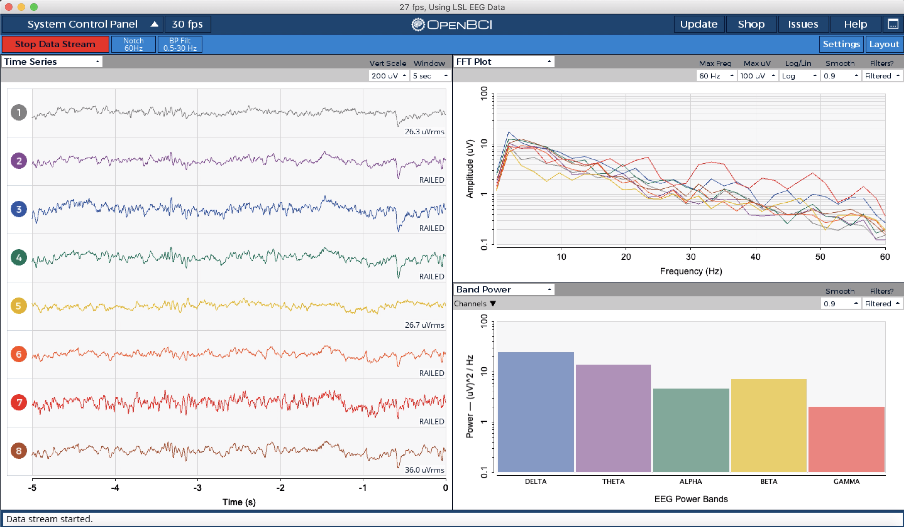

.. _local-streaming:

Local Streaming
===============

This part of the documentation is about streaming data from HackEEG to software running on the same
computer, like a laptop.

Connecting OpenBCI to HackEEG via Lab Streaming Layer
-----------------------------------------------------

#. **IMPORTANT!** Ensure you are running on battery power. HackEEG has no mains isolation circuitry.
#. Start the ``hackeeg_stream`` program:

    .. code-block:: bash

       $ hackeeg_stream --sps 500 --continuous --lsl

#. Start OpenBCI as described in :ref:`OpenBCI <openbci>`
#. Select ``Live (from Lab Streaming Layer)``
#. Select ``8 channels``
#. Click ``Start Session``
#. Click ``Start Data Stream``
#. In the lower right widget drop-down, select the Band Power widget
#. You should see something like this:

